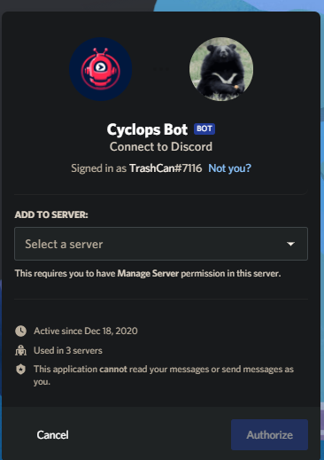

# Inviting Cyclops

## Prerequisites

Make sure you have the `Manage_Server` permission in your server you want to invite Cyclops to

## How to Invite?

Go to the following[ link](https://discord.com/api/oauth2/authorize?client_id=789586602133159936&permissions=0&redirect_uri=https%3A%2F%2Fdiscord.com%2Fapi%2Foauth2%2Fauthorize%3Fclient_id%3D789586602133159936%26permissions%3D0%26scope%3Dbot&scope=bot) to find the invite to cyclops. If you aren't signed into Discord on the web, you will be asked to do so. Once signed in, you will be greeted with the page below. Select a server, click Continue, review permissions then click Authorize and complete the Captcha. Cyclops should now be in your server


By default Cyclops grants the least amount of permissions for it to be able to work correctly. It is not recommended that you give it admin


